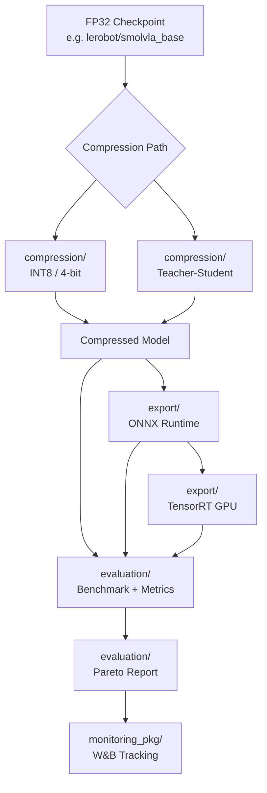

# lerobot-edge

> Policy compression and edge deployment plugin for [HuggingFace LeRobot](https://github.com/huggingface/lerobot)

**lerobot_edge** is a standalone extension package that plugs into LeRobot's policy system to add quantization, ONNX export, teacher-student distillation, benchmarking, evaluation metrics, and experiment tracking for edge deployment.

## Architecture



### Package Layout

```
lerobot_edge/
  core/              # Backends, configs, router, utilities
  compression/       # Quantization (INT8, 4-bit) and distillation
  export/            # ONNX export and TensorRT export
  evaluation/        # Benchmark harness, metrics, Pareto reports
  monitoring_pkg/    # W&B experiment tracking, local JSON fallback
  configs.py         # Config dataclasses (backward-compatible re-export)
  quantize.py        # Quantization functions (backward-compatible re-export)
  benchmark.py       # Benchmark harness (backward-compatible re-export)
  ...
```

## Installation

```bash
pip install lerobot-edge
pip install "lerobot-edge[onnx]"        # ONNX support
pip install "lerobot-edge[quantize]"    # bitsandbytes
pip install "lerobot-edge[tensorrt]"    # TensorRT (GPU)
pip install "lerobot-edge[wandb]"       # W&B experiment tracking
pip install "lerobot-edge[all]"         # everything
```

## Quickstart

### Baseline (unmodified LeRobot)

```bash
lerobot-eval \
  --policy.type=smolvla \
  --policy.pretrained_path=lerobot/smolvla_base \
  --env.type=pusht --eval.n_episodes=10
```

### Edge Plugin (identity wrapper)

```bash
lerobot-eval \
  --policy.type=edge_identity \
  --policy.pretrained_path=lerobot/smolvla_base \
  --env.type=pusht --eval.n_episodes=10
```

### Quantized Variant

```bash
lerobot-eval \
  --policy.type=edge_quant_int8 \
  --policy.pretrained_path=lerobot/smolvla_base \
  --env.type=pusht --eval.n_episodes=10
```

## Available Variants

| Variant | Description | Requirements |
|---------|-------------|--------------|
| `edge_identity` | Passthrough wrapper | Core |
| `edge_quant_int8` | Dynamic INT8 quantization | Core |
| `edge_onnx_fp32` | ONNX Runtime (FP32) | `lerobot-edge[onnx]` |
| `edge_onnx_int8` | ONNX Runtime (INT8) | `lerobot-edge[onnx]` |
| `edge_distilled` | Teacher-student distilled | Core |
| `edge_distilled_onnx_int8` | Distilled + ONNX + INT8 | `lerobot-edge[onnx]` |

## Makefile Commands

```bash
# Install
make install            # pip install -e .
make install-dev        # pip install -e ".[dev,all]"

# Test
make test               # run non-slow tests
make test-all           # run all tests including integration
make test-evaluation    # run evaluation + monitoring tests only

# Lint
make lint               # ruff check
make format             # ruff format
make typecheck          # mypy

# Pipeline
make benchmark CHECKPOINT=lerobot/smolvla_base OUTPUT_DIR=benchmark_results
make quantize CHECKPOINT=lerobot/smolvla_base
make evaluate OUTPUT_DIR=benchmark_results

# CI
make ci                 # install-dev + lint + typecheck + test
```

## Benchmarking

```bash
lerobot-edge-benchmark \
  --checkpoint=lerobot/smolvla_base \
  --variants=edge_identity edge_quant_int8 \
  --device-profile=laptop_cpu \
  --output-dir=benchmark_results

lerobot-edge-report \
  --results-dir=benchmark_results \
  --output-dir=docs
```

## Evaluation Metrics

The `evaluation` module provides tools for assessing quantization quality:

- **Output Divergence**: MSE, MAE, cosine similarity, max absolute error between original and quantized model outputs
- **Quantization Quality Report**: Compression ratio, memory savings, speedup ratio, quality degradation
- **Bootstrap Confidence Intervals**: Statistical confidence intervals for any metric
- **Backend Comparison**: Side-by-side comparison of original vs quantized models

```python
from lerobot_edge.evaluation import compare_backends, bootstrap_confidence_interval

# Compare original vs quantized model
report = compare_backends(original_model, quantized_model, dummy_input, num_samples=10)
print(report.to_dict())

# Compute confidence intervals for latency measurements
mean, lower, upper = bootstrap_confidence_interval(latency_list, confidence=0.95)
```

## Experiment Tracking

The `monitoring` module provides optional Weights & Biases integration:

```python
from lerobot_edge.monitoring import ExperimentTracker, TrackConfig

config = TrackConfig(project="my-project", tags=["int8-quantization"])
tracker = ExperimentTracker(config=config)

tracker.init_run(run_name="quant-int8-v1")
tracker.log_benchmark_result(result_dict)
tracker.log_quality_report(quality_dict)
tracker.log_artifact("model", "model", "quantized/model.pt")
tracker.finish_run()
```

When W&B is not installed, the tracker falls back to local JSON logging in `wandb_logs/`.

## How the Plugin Works

Config classes register with LeRobot's `draccus.ChoiceRegistry` via `@PreTrainedConfig.register_subclass("edge_*")`. The factory fallback discovers them by naming convention. Zero changes to LeRobot source required.

## Development

```bash
make install-dev
make test
make lint
make ci
```

## Attribution

lerobot_edge is a plugin for [LeRobot](https://github.com/huggingface/lerobot) (Apache-2.0). It installs alongside stock `pip install lerobot` with no modifications to upstream code.

## License

Apache-2.0 — see [LICENSE](LICENSE).
