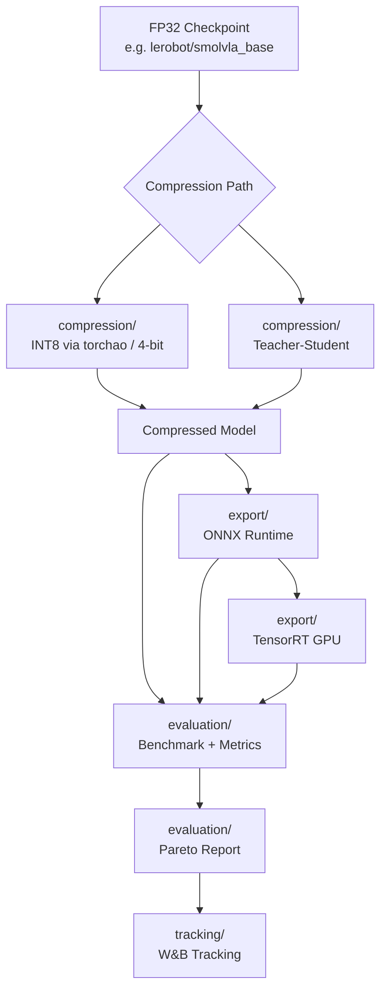

# lerobot-edge

> Policy compression and edge deployment plugin for [HuggingFace LeRobot](https://github.com/huggingface/lerobot)

**lerobot_edge** plugs into LeRobot's policy system to add quantization (INT8 via torchao), ONNX export, TensorRT inference, teacher-student distillation, benchmarking with quality gates, evaluation metrics, and experiment tracking for edge deployment.

## Architecture



### Package Layout

```
lerobot_edge/
  core/              # Backends, configs, router, utilities
  compression/       # Quantization (INT8 via torchao, 4-bit) and distillation
  export/            # ONNX export and TensorRT export with I/O bindings
  evaluation/        # Benchmark harness, metrics, Pareto reports, quality gate
  tracking/          # W&B experiment tracking, local JSON fallback
scripts/             # Shell scripts for common operations
```

## Installation

```bash
pip install lerobot-edge
pip install "lerobot-edge[onnx]"        # ONNX support
pip install "lerobot-edge[quantize]"    # bitsandbytes
pip install "lerobot-edge[tensorrt]"    # TensorRT (GPU, requires pycuda)
pip install "lerobot-edge[wandb]"       # W&B experiment tracking
pip install "lerobot-edge[all]"         # everything
```

## Quickstart

### Evaluate with edge plugin

```bash
lerobot-eval \
  --policy.type=edge_quant_int8 \
  --policy.pretrained_path=lerobot/smolvla_base \
  --env.type=pusht --eval.n_episodes=10
```

### Benchmark

```bash
bash scripts/benchmark.sh lerobot/smolvla_base
```

### Quantize

```bash
bash scripts/quantize.sh lerobot/smolvla_base ./quantized dynamic_int8
```

### Full pipeline

```bash
bash scripts/run_pipeline.sh lerobot/smolvla_base
```

## Available Variants

| Variant | Description | Requirements |
|---------|-------------|--------------|
| `edge_identity` | Passthrough wrapper | Core |
| `edge_quant_int8` | Dynamic INT8 quantization (torchao) | Core |
| `edge_onnx_fp32` | ONNX Runtime (FP32) | `lerobot-edge[onnx]` |
| `edge_onnx_int8` | ONNX Runtime (INT8) | `lerobot-edge[onnx]` |
| `edge_distilled` | Teacher-student distilled | Core |
| `edge_distilled_onnx_int8` | Distilled + ONNX + INT8 | `lerobot-edge[onnx]` |

## Benchmark Results

SmolVLA (864 MB, ~450M params) — measured on real hardware:

| Backend | GPU Latency (ms) | GPU FPS | CPU Latency (ms) | CPU FPS | Quality Gate |
|---------|-----------------|---------|-----------------|---------|-------------|
| Identity (FP32) | 1.47 | 681.8 | 3.75 | 266.8 | cos=1.000000 |
| Dynamic INT8 | 1.55 | 644.6 | 5.78 | 173.1 | cos=0.9878 |
| Identity + torch.compile | 1.87 | 534.8 | -- | -- | cos=1.000000 |
| INT8 + torch.compile | 2.50 | 399.5 | -- | -- | cos=0.9946 |

> GPU INT8 overhead is minimal — INT8 tensor cores handle dequantization efficiently.
> CPU INT8 adds 54% overhead — use GPU or `torch.compile` for real speedup.
> Quality gate defaults to `min_cosine_similarity=0.98`. For strict validation, set it to `0.999`.

## Makefile

```bash
make install-dev    # pip install -e ".[dev,all]"
make test           # run non-slow tests
make lint           # ruff check
make format         # ruff format
make typecheck      # mypy
make ci             # lint + typecheck + test
make benchmark      # run benchmark
make quantize       # quantize checkpoint
make evaluate       # generate report
```

## API Usage

```python
from lerobot_edge.core.configs import EdgeQuantInt8Config
from lerobot_edge.compression.quantize import QuantizedBackend
from lerobot_edge.evaluation.gate import QualityGate

# Quantize
config = EdgeQuantInt8Config(device="cpu")
backend = QuantizedBackend.from_policy(policy, config)

# Quality gate
gate = QualityGate(min_cosine_similarity=0.999)
result = gate.check(original, quantized, dummy_input)

# Tracking
from lerobot_edge.tracking import ExperimentTracker, TrackConfig
tracker = ExperimentTracker(config=TrackConfig(project="my-project"))
tracker.init_run("run-1")
tracker.log_benchmark_result(result_dict)
tracker.finish_run()
```

## How It Works

Config classes register with LeRobot's `draccus.ChoiceRegistry` via `@PreTrainedConfig.register_subclass("edge_*")`. Zero changes to LeRobot source required.

## License

Apache-2.0 — see [LICENSE](LICENSE).
