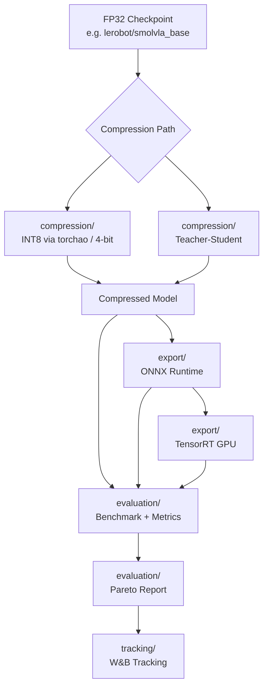

# lerobot-edge

> Policy compression and edge deployment plugin for [HuggingFace LeRobot](https://github.com/huggingface/lerobot)

**lerobot_edge** plugs into LeRobot's policy system to add quantization (INT8 via torchao), ONNX export, TensorRT inference, teacher-student distillation, benchmarking with quality gates, evaluation metrics, and experiment tracking for edge deployment.

## Architecture



### Package Layout

```
lerobot_edge/
  core/              # Backends, configs, router, utilities
  compression/       # Quantization (INT8 via torchao, 4-bit) and distillation
  export/            # ONNX export and TensorRT export with I/O bindings
  evaluation/        # Benchmark harness, metrics, Pareto reports, quality gate
  tracking/          # W&B experiment tracking, local JSON fallback
```

## Installation

```bash
pip install lerobot-edge
pip install "lerobot-edge[onnx]"        # ONNX support
pip install "lerobot-edge[quantize]"    # bitsandbytes
pip install "lerobot-edge[tensorrt]"    # TensorRT (GPU, requires pycuda)
pip install "lerobot-edge[wandb]"       # W&B experiment tracking
pip install "lerobot-edge[all]"         # everything
```

### Dependencies

- **torchao** (>=0.17.0) is required for quantization. Dynamic INT8 uses `Int8DynamicActivationInt8WeightConfig`, static INT8 uses `AffineQuantizedMinMaxObserver` with custom `ObservedLinear` / `QuantizedLinear` modules.

## Quickstart

### Baseline (unmodified LeRobot)

```bash
lerobot-eval \
  --policy.type=smolvla \
  --policy.pretrained_path=lerobot/smolvla_base \
  --env.type=pusht --eval.n_episodes=10
```

### Edge Plugin (identity wrapper)

```bash
lerobot-eval \
  --policy.type=edge_identity \
  --policy.pretrained_path=lerobot/smolvla_base \
  --env.type=pusht --eval.n_episodes=10
```

### Quantized Variant

```bash
lerobot-eval \
  --policy.type=edge_quant_int8 \
  --policy.pretrained_path=lerobot/smolvla_base \
  --env.type=pusht --eval.n_episodes=10
```

## Available Variants

| Variant | Description | Requirements |
|---------|-------------|--------------|
| `edge_identity` | Passthrough wrapper | Core |
| `edge_quant_int8` | Dynamic INT8 quantization (torchao) | Core |
| `edge_onnx_fp32` | ONNX Runtime (FP32) | `lerobot-edge[onnx]` |
| `edge_onnx_int8` | ONNX Runtime (INT8) | `lerobot-edge[onnx]` |
| `edge_distilled` | Teacher-student distilled | Core |
| `edge_distilled_onnx_int8` | Distilled + ONNX + INT8 | `lerobot-edge[onnx]` |

> **GPU-only**: TensorRT backends require a CUDA-capable GPU and the `tensorrt` + `pycuda` packages.

## Makefile Commands

```bash
# Install
make install            # pip install -e .
make install-dev        # pip install -e ".[dev,all]"

# Test
make test               # run non-slow tests
make test-all           # run all tests including integration
make test-evaluation    # run evaluation + monitoring tests only

# Lint
make lint               # ruff check
make format             # ruff format
make typecheck          # mypy

# Pipeline
make benchmark CHECKPOINT=lerobot/smolvla_base OUTPUT_DIR=benchmark_results
make quantize CHECKPOINT=lerobot/smolvla_base
make evaluate OUTPUT_DIR=benchmark_results

# CI
make ci                 # install-dev + lint + typecheck + test
```

## Benchmarking

### Full Pipeline Benchmark

```bash
lerobot-edge-benchmark \
  --checkpoint=lerobot/smolvla_base \
  --variants=edge_identity edge_quant_int8 \
  --device-profile=laptop_cpu \
  --output-dir=benchmark_results
```

### Backend Comparison

Compare identity vs INT8 quantized backends:

```bash
python -m lerobot_edge.evaluation.compare_backends \
  --warmup 10 --num-runs 100 --device cpu
```

### Generate Report

```bash
lerobot-edge-report \
  --results-dir=benchmark_results \
  --output-dir docs
```

## Configuration

### Custom Policy Type

By default, `CompressedPolicy._build_backend_from_checkpoint` loads SmolVLA checkpoints. To use a different architecture, set `source_policy_type` in your config:

```python
from lerobot_edge.core.configs import EdgeQuantInt8Config

config = EdgeQuantInt8Config(
    source_pretrained_path="path/to/checkpoint",
    source_policy_type="act",  # or any LeRobot policy type
    device="cpu",
)
```

## Evaluation Metrics

### Quality Gate

Quantization is validated against a divergence gate before deployment. If cosine similarity between original and quantized outputs drops below the threshold (default 0.999, mirroring the D-Robotics pattern), the gate fails and the benchmark reports a failure:

```python
from lerobot_edge.evaluation import QualityGate

gate = QualityGate(min_cosine_similarity=0.999, num_samples=20)
result = gate.check(original_model, quantized_model, dummy_input)
print(result.message)  # "PASSED (cos=0.999998, mse=0.00000123)" or "FAILED: ..."
if not result.passed:
    raise RuntimeError(result.message)
```

The gate runs automatically during `compare_backends` and `lerobot-edge-benchmark`.

### Backend Comparison

Benchmark results on a 7-layer MLP (CPU, 50 runs, 10 warmup):

| Backend | Latency (ms) | Throughput (FPS) | Quality Gate |
|---------|-------------|-----------------|-------------|
| Identity (FP32) | 0.05 | 21,329 | cos=1.000000 |
| Dynamic INT8 | 0.84 | 1,194 | cos=1.000000 |

> INT8 overhead on small models is expected. Real benefits appear on models >100M params or with `torch.compile`.

To benchmark a real checkpoint, install `lerobot` with its simulation environment and run:

```bash
python -m lerobot_edge.evaluation.compare_backends \
  --checkpoint lerobot/smolvla_base --policy-type smolvla
```

```python
from lerobot_edge.evaluation import compare_backends, bootstrap_confidence_interval

report = compare_backends(original_model, quantized_model, dummy_input, num_samples=10)
print(report.to_dict())

mean, lower, upper = bootstrap_confidence_interval(latency_list, confidence=0.95)
```

### Metrics Provided

- **Output Divergence**: MSE, MAE, cosine similarity, max absolute error
- **Quality Report**: Compression ratio, memory savings, speedup ratio, quality degradation
- **Bootstrap Confidence Intervals**: Statistical confidence for any metric

## Experiment Tracking

The `tracking` module provides optional Weights & Biases integration:

```python
from lerobot_edge.tracking import ExperimentTracker, TrackConfig

config = TrackConfig(project="my-project", tags=["int8-quantization"])
tracker = ExperimentTracker(config=config)

tracker.init_run(run_name="quant-int8-v1")
tracker.log_benchmark_result(result_dict)
tracker.log_quality_report(quality_dict)
tracker.log_artifact("model", "model", "quantized/model.pt")
tracker.finish_run()
```

When W&B is not installed, the tracker falls back to local JSON logging in `wandb_logs/`.

## How the Plugin Works

Config classes register with LeRobot's `draccus.ChoiceRegistry` via `@PreTrainedConfig.register_subclass("edge_*")`. The factory fallback discovers them by naming convention. Zero changes to LeRobot source required.

## Development

```bash
make install-dev
make test
make lint
make ci
```

## Attribution

lerobot_edge is a plugin for [LeRobot](https://github.com/huggingface/lerobot) (Apache-2.0). It installs alongside stock `pip install lerobot` with no modifications to upstream code.

## License

Apache-2.0 — see [LICENSE](LICENSE).
