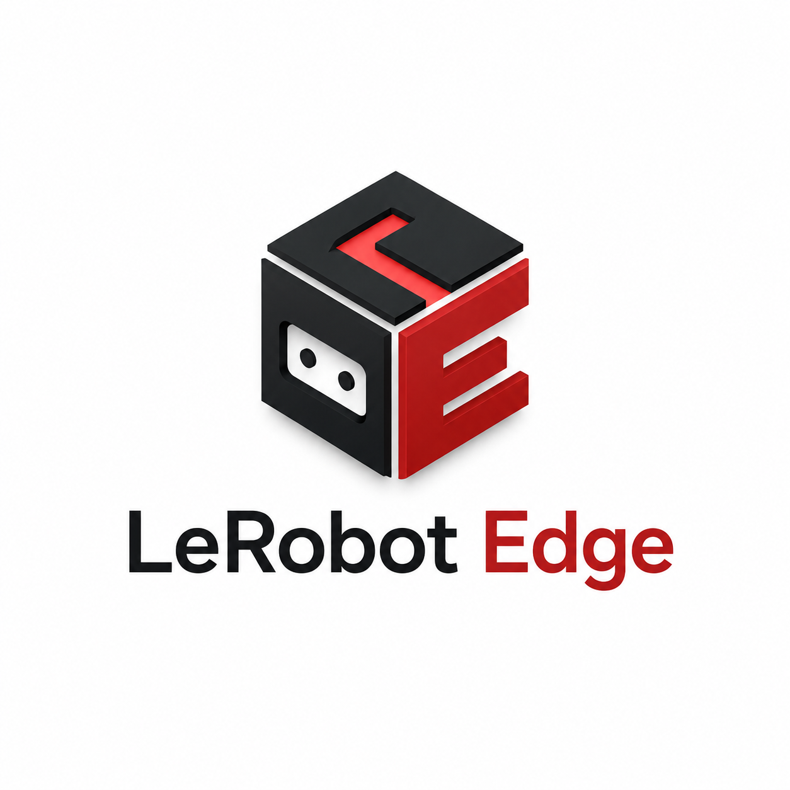

Quantization, export, and benchmarking for deploying [LeRobot](https://github.com/huggingface/lerobot) policies on edge GPUs. Zero source modifications.

## Install

```bash
pip install lerobot-edge                    # core (SDPA + KV-cache + torchao INT8/INT4)
pip install "lerobot-edge[quantize]"        # + bitsandbytes NF4/FP4
pip install "lerobot-edge[compile]"         # + triton (Linux, for torch.compile)
pip install "lerobot-edge[onnx]"            # + ONNX export
pip install "lerobot-edge[all]"             # everything
```

Same command works on both OSes — `[compile]` installs Triton on Linux, silently skipped on Windows.

## Platform support

```bash
python -c "from lerobot_edge.core import get_platform_info; import json; print(json.dumps(get_platform_info(), indent=2, default=str))"
```

| Feature | Linux | Windows |
|---------|-------|---------|
| SDPA/FlashAttention | ✅ | ✅ |
| INT8 KV-cache quant | ✅ | ✅ |
| torchao INT4 quant | ✅ | ✅ |
| bitsandbytes NF4/FP4 | ✅ | ✅ |
| `torch.compile` | ✅ (Triton) | ❌ |
| CUDA graphs | ✅ | ✅ |
| ONNX export | ✅ | ✅ |
| TensorRT | ✅ | ❌ |

`torch.compile` requires Triton (Linux). On Windows, all optimizations except compile work and are auto-detected.

## Quickstart

```bash
# Evaluate quantized policy
lerobot-eval --policy.type=edge_quant_int4 --policy.pretrained_path=lerobot/smolvla_base

# Quantize a checkpoint
lerobot-edge-quantize --source lerobot/smolvla_base --output ./quantized --method int4

# Benchmark all backends
python -m benchmarks.bench_smolvla --batch-sizes 1,4

# A/B experiment grid
lerobot-edge-experiment --checkpoint lerobot/smolvla_base --methods fp32 int4

# Regression dashboard
lerobot-edge-regression --dirs benchmark_results
```

## Variants

| Variant | Method | Library |
|---------|--------|---------|
| `edge_identity` | FP32 passthrough | core |
| `edge_quant_int8` | Dynamic INT8 | torchao |
| `edge_quant_int4` | INT4 weight-only (recommended) | torchao |
| `edge_quant_bnb_int8` | Linear8bitLt INT8 | bitsandbytes |
| `edge_quant_bnb_nf4` | NF4 4-bit | bitsandbytes |
| `edge_quant_bnb_fp4` | FP4 4-bit | bitsandbytes |
| `edge_onnx_fp32` | ONNX Runtime FP32 | onnx |
| `edge_onnx_int8` | ONNX Runtime INT8 | onnx |

## Optimizations

Three optimizations applied at load time (auto-detect capability):

1. **SDPA/FlashAttention** — 2.06× speedup on SmolVLA
2. **INT8 KV-cache** — 3.98× compression, lossless
3. **torchao INT4** — 4× memory reduction

```python
from lerobot_edge.optimization import optimize_policy_for_inference

policy = optimize_policy_for_inference(policy,
    enable_attention=True,          # SDPA/FlashAttention
    enable_kv_cache_quant=True,     # INT8 KV-cache
    enable_compile=True,            # torch.compile (needs [compile] extra)
)
```

## Benchmarks

SmolVLA (450M) on RTX 5060 (7 GB), bs=1:

| Backend | Latency | Memory |
|---------|---------|--------|
| FP32 + SDPA | 8.77 ms | 1142 MB |
| FP16 + SDPA | 8.49 ms | 571 MB |
| NF4 + SDPA | 8.92 ms | 287 MB |

SDPA: 2.06× over eager (18.07→8.77 ms). NF4: 3.97× less memory.

## Dev

```bash
make install-dev
make test
make lint
make format
make typecheck
```

## License

Apache-2.0
