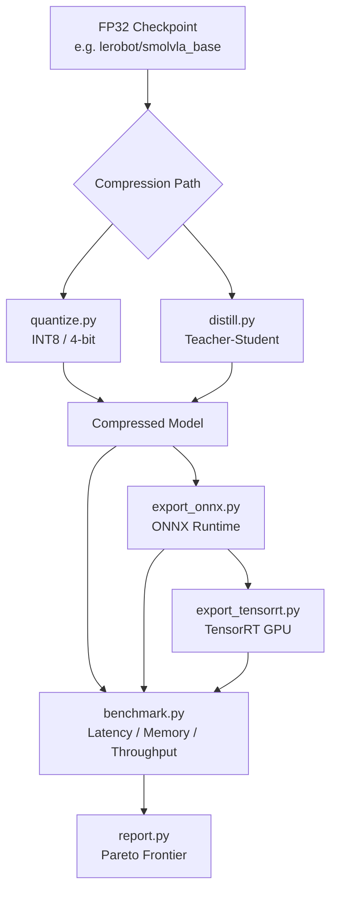
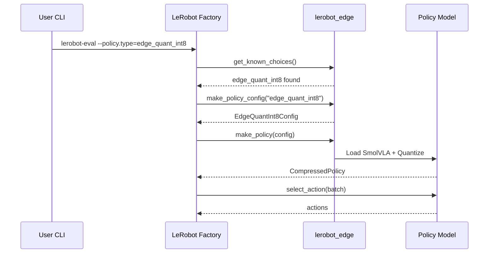

# lerobot-edge

> Policy compression and edge deployment plugin for [HuggingFace LeRobot](https://github.com/huggingface/lerobot)

**lerobot_edge** is a standalone extension package that plugs into LeRobot's policy system to add quantization, ONNX export, teacher-student distillation, and benchmarking for edge deployment.

## Architecture



## Installation

```bash
pip install lerobot-edge
pip install "lerobot-edge[onnx]"        # with ONNX support
pip install "lerobot-edge[quantize]"    # with bitsandbytes
pip install "lerobot-edge[tensorrt]"    # with TensorRT (GPU)
pip install "lerobot-edge[all]"         # everything
```

## Quickstart

### Baseline (unmodified LeRobot)

```bash
lerobot-eval \
  --policy.type=smolvla \
  --policy.pretrained_path=lerobot/smolvla_base \
  --env.type=pusht --eval.n_episodes=10
```

### Edge Plugin (identity wrapper)

```bash
lerobot-eval \
  --policy.type=edge_identity \
  --policy.pretrained_path=lerobot/smolvla_base \
  --env.type=pusht --eval.n_episodes=10
```

### Quantized Variant

```bash
lerobot-eval \
  --policy.type=edge_quant_int8 \
  --policy.pretrained_path=lerobot/smolvla_base \
  --env.type=pusht --eval.n_episodes=10
```

## Available Variants

| Variant | Description | Requirements |
|---------|-------------|--------------|
| `edge_identity` | Passthrough wrapper | Core |
| `edge_quant_int8` | Dynamic INT8 quantization | Core |
| `edge_onnx_fp32` | ONNX Runtime (FP32) | `lerobot-edge[onnx]` |
| `edge_onnx_int8` | ONNX Runtime (INT8) | `lerobot-edge[onnx]` |
| `edge_distilled` | Teacher-student distilled | Core |
| `edge_distilled_onnx_int8` | Distilled + ONNX + INT8 | `lerobot-edge[onnx]` |

## Benchmarking

```bash
lerobot-edge-benchmark \
  --checkpoint=lerobot/smolvla_base \
  --variants=edge_identity edge_quant_int8 \
  --device-profile=laptop_cpu \
  --output-dir=benchmark_results

lerobot-edge-report \
  --results-dir=benchmark_results \
  --output-dir=docs
```

## Development

```bash
pip install -e ".[dev]"
pytest
pytest --cov=lerobot_edge
ruff check lerobot_edge/
```

## How the Plugin Works

Config classes register with LeRobot's `draccus.ChoiceRegistry` via `@PreTrainedConfig.register_subclass("edge_*")`. The factory fallback discovers them by naming convention. Zero changes to LeRobot source required.



## Attribution

lerobot_edge is a plugin for [LeRobot](https://github.com/huggingface/lerobot) (Apache-2.0). It installs alongside stock `pip install lerobot` with no modifications to upstream code.

## License

Apache-2.0 — see [LICENSE](LICENSE).
